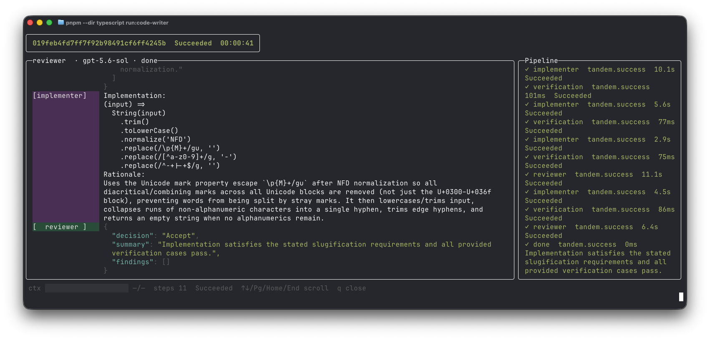
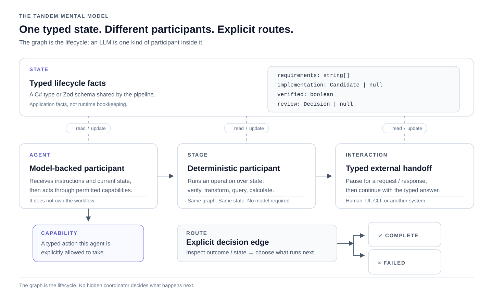

# Tandem

Tandem is a typed SDK for building agentic applications as explicit pipelines. Define the lifecycle in code, then run
and inspect it.

```typescript
const codeWriter = pipeline({
  // Give the complete lifecycle one name in logs and the ledger.
  name: "code-writer",
  // Every node reads and returns this same state shape.
  state: State,

  // List everything that can take a turn or finish the run.
  nodes: [implementer, verification, reviewer, done, failed],
  // The implementer receives the initial state first.
  start: implementer,

  routes: [
    // Submitted code always goes through normal verification.
    route({
      from: implementer,
      to: verification,
      outcome: "success",
    }),
    // Passing code is ready for review.
    route({
      from: verification,
      to: reviewer,
      when: (state) => state.verification?.passed === true,
    }),
    // Failed checks send their evidence back to the implementer.
    route({
      from: verification,
      to: implementer,
      when: (state) => state.verification?.passed === false,
    }),
  ],

  // These are the only places the run may finish.
  outputs: [done, failed],
  // Keep accepted values so this run can be inspected later.
  persist: true,
});
```

<p align="center">
  
</p>

Define the facts your application knows, add participants that can act on those facts, and connect them with named
routes. Participants can be model-backed agents, deterministic stages, or typed interactions with the outside world.

Tandem runs in-process on .NET. Use it directly from C#, or author the same
pipeline with the TypeScript SDK. Microsoft Agent Framework owns live workflow execution, model loops,
sessions, and tool dispatch underneath Tandem's typed application model.

## The mental model

A Tandem application is built from a small set of pieces:

<p align="center">
  
</p>

| Piece           | Think of it as                | What it means                                                     |
|-----------------|-------------------------------|-------------------------------------------------------------------|
| **State**       | The facts                     | Your application's typed lifecycle state: a C# type or Zod schema |
| **Participant** | A box that gets a turn        | The common idea behind agents, stages, and interactions           |
| **Agent**       | A model-backed participant    | Receives instructions and a message derived from current state    |
| **Stage**       | A deterministic participant   | Runs a normal operation and may return updated state              |
| **Capability**  | A typed action                | Something an agent is explicitly permitted to do                  |
| **Interaction** | A typed handoff               | Waits for an external request/response before continuing          |
| **Route**       | An arrow / `if`               | Explicitly decides which participant runs next                    |
| **Output**      | An end point                  | A named successful or failed terminal                             |
| **Outcome**     | Did this participant execute? | Canonical `Success` / `Failed`, separate from domain decisions    |

If you know typed objects, functions, function calling, and `if` statements, you already know most of the ideas Tandem
builds on.

## State is the shared model

Every participant in a pipeline operates over the same application-owned state type.

For our Code Writer example, the important facts are:

### TypeScript

```ts
import { z } from "zod";

export const State = z.object({
    // The job both agents are working towards.
    requirements: z.array(z.string().min(1)).min(1),
    // Source and rationale accepted from the implementer.
    implementation: ImplementationCandidate.nullable(),
    // Evidence produced by running normal verification code.
    verification: VerificationResult.nullable(),
    // The reviewer's accepted decision.
    review: ReviewDecision.nullable(),
});

// The schema is also the single source of the TypeScript type.
export type State = z.infer<typeof State>;
```

### C#

```csharp
public sealed record CodeWriterState(
    // The job both agents are working towards.
    IReadOnlyList<string> Requirements,
    // Source and rationale accepted from the implementer.
    ImplementationCandidate? Implementation = null,
    // Evidence produced by normal C# verification.
    VerificationResult? Verification = null,
    // The reviewer's accepted decision.
    ReviewDecision? Review = null
);
```

State contains **application facts**. It does not need to contain Tandem bookkeeping such as the current node, run ID,
invocation ID, route name, or resume position.

When something meaningful changes return a new state representing the new facts, and the graph decides where those facts
send the run next.

## Agents

An agent has:

* a stable identity;
* instructions;
* a model client;
* a message derived from current state;
* optional typed capabilities;
* optional structured output; and
* optional session continuation.

### TypeScript

```ts
const reviewer = agent<State, ReviewDecision>({
    // Routes and ledger entries refer to this stable name.
    id: "reviewer",
    // Keep the role narrow: judge the exact candidate and evidence.
    instructions:
        "Review the exact implementation against the requirements and passing verification evidence.",
    // The host chooses which model performs this role.
    client: clients.reviewer,

    // Build each visit from the latest facts, not hidden conversation state.
    message: (state) =>
        [
            `Requirements: ${JSON.stringify(state.requirements)}`,
            `Exact source: ${state.implementation!.source}`,
            `Passing verification evidence: ${JSON.stringify(state.verification)}`,
        ].join("\n"),

    output: {
        // Ask for the decision the application needs, not arbitrary prose.
        instructions:
            "Return Accept or RequestChanges with a concise summary and concrete findings.",
        // Tandem corrects anything that does not match this shape.
        schema: ReviewDecision,
        // Only an accepted decision is allowed to update state.
        apply: recordReview,
    },
});
```

### C#

```csharp
var reviewer = Agent
    .Create<CodeWriterState>(
        // Routes and ledger entries refer to this stable name.
        "reviewer",
        // Keep the role narrow: judge the exact candidate and evidence.
        "Review the exact implementation against the requirements and passing verification evidence.",
        // The host chooses which model performs this role.
        clients.Reviewer)
    // Build each visit from the latest accepted candidate and checks.
    .WithMessage(state =>
        $"Exact source: {state.Implementation!.Source}\n"
        + $"Passing verification evidence: {JsonSerializer.Serialize(state.Verification)}")
    .WithOutput(
        // This definition owns the response shape and validation.
        new ReviewDecisionOutput(),
        // Only an accepted decision is allowed to update state.
        (state, review) => state.RecordReview(review))
    .Build();
```

`continueSession: true` in TypeScript or `.ContinueSession()` in C# sets whether the agent session should be reused
when the pipeline routes back to that agent

## Typed model output becomes application state

Tandem's structured outputs and capabilities give that boundary an application-owned type. For
example, Code Writer does not ask the Reviewer for arbitrary prose and then ask another model what that prose means.

### TypeScript

```ts
export const ReviewDecision = z
    .object({
        // The graph only needs one of these two decisions.
        decision: z.enum(["Accept", "RequestChanges"]),
        // Give the caller a concise account of the review.
        summary: z.string().min(1),
        // Requested changes must say exactly what needs fixing.
        findings: z.array(z.string().min(1)),
    })
    // Do not allow an empty RequestChanges response into state.
    .refine(
        (review) =>
            review.decision !== "RequestChanges" ||
            review.findings.length > 0,
        {
            path: ["findings"],
            message: "RequestChanges requires at least one finding",
        },
    );
```

### C#

```csharp
public enum ReviewDisposition
{
    // The candidate may leave the graph successfully.
    Accept,
    // The candidate needs another implementer turn.
    RequestChanges,
}

public sealed record ReviewDecision(
    // Routes use this value to finish or loop.
    ReviewDisposition Decision,
    // The caller can show this account directly.
    string Summary,
    // Requested changes carry concrete work for the next turn.
    IReadOnlyList<string> Findings
);
```

The output is validated before Tandem applies it to state.

After that, this:

```ts
state.review?.decision === "Accept"
```

or this:

```csharp
state.Review?.Decision == ReviewDisposition.Accept
```

is just an ordinary application fact and a route can make an ordinary deterministic decision from it.

## Capabilities

For the Implementer, submitting code is not an arbitrary tool result. It is an application operation with a request
type, validation, a summary, and a state transition.

### TypeScript

```ts
const submitImplementation = capability({
    // This becomes the function name exposed to the implementer.
    name: "submit_implementation",
    // Tell the model what a complete call must contain.
    instructions:
        "Submit the complete JavaScript implementation and its rationale.",

    // Reject empty source or rationale before application code sees it.
    schema: z.object({
        implementation: z.string().min(1),
        rationale: z.string().min(1),
    }),

    // An accepted call records the new candidate and clears stale checks.
    apply: (state: State, submission) =>
        recordImplementation(state, {
            source: submission.implementation,
            rationale: submission.rationale,
        }),

    // Keep the ledger entry useful without storing the whole prompt.
    summarize: (submission) => submission.rationale,
});
```

Attach it to the intended agent:

```ts
const implementer = agent<State>({
    // This identity stays stable when the graph loops back.
    id: "implementer",
    // These instructions remain the same on every visit.
    instructions: "Implement the requested function.",
    // The host supplies the model used for implementation.
    client: clients.implementer,
    // Each turn is grounded in the latest application state.
    message: implementerMessage,
    // Submitting an implementation is the only action this agent may take.
    capabilities: [submitImplementation],
    // Preserve its conversation when verification or review sends work back.
    continueSession: true,
});
```

### C#

In C#, the capability definition owns its semantic contract:

```csharp
public sealed class SubmitImplementationCapability
    : IAgentCapabilityDefinition<CodeWriterState, SubmitImplementation>
{
    // This is the function name exposed to the model.
    public string ToolName => "submit_implementation";

    // Tell the model what a complete call must contain.
    public string Instructions =>
        "Submit the complete JavaScript implementation and its rationale.";

    // Reject invalid calls before application code sees them.
    public IValidator<SubmitImplementation> Validator { get; } =
        new SubmitImplementationValidator();

    // Keep the accepted call readable in observations and the ledger.
    public string Summarize(SubmitImplementation request) =>
        request.Rationale;
}
```

Then bind its accepted request to a typed state transition:

```csharp
var submitImplementation =
    AgentCapabilities.Create<CodeWriterState, SubmitImplementation>(
        // Reuse the function name, instructions, validation, and summary above.
        new SubmitImplementationCapability(),
        // An accepted call records the candidate and clears stale checks.
        (state, submission) =>
            state.RecordImplementation(submission));
```

And attach it to the agent:

```csharp
var implementer = Agent
    .Create<CodeWriterState>(
        // This identity stays stable when the graph loops back.
        "implementer",
        // These instructions remain the same on every visit.
        "Implement the requested function.",
        // The host supplies the model used for implementation.
        clients.Implementer)
    // Each turn is grounded in the latest application state.
    .WithMessage(ImplementerMessage)
    // Submitting an implementation is the only action it may take.
    .WithCapability(submitImplementation)
    // Preserve its conversation when the graph sends work back.
    .ContinueSession()
    .Build();
```

An accepted capability call concludes that agent visit. The updated state is then handed back to the pipeline, which
evaluates the configured routes.

## Stages

Stages use the same state as agents and are routed in exactly the same graph.

Code Writer's verification step is a stage because testing the submitted implementation does not require another model.

### TypeScript

```ts
const verification = stage<State>({
    // Routes refer to this check by a stable name.
    id: "verification",

    execute: async (state) =>
        recordVerification(
            state,
            // Run ordinary code and put its evidence back into state.
            await assessImplementation(state.implementation!.source),
        ),
});
```

### C#

```csharp
[PipelineStage("verification")]
public sealed partial class VerificationStage
{
    // The stage owns the normal C# service that performs the check.
    private readonly ImplementationAssessment _assessment = new();

    public async ValueTask<CodeWriterState> ExecuteAsync(
        CodeWriterState state,
        CancellationToken cancellationToken)
    {
        // Verification cannot run until an implementation has been accepted.
        var source =
            state.Implementation?.Source
            ?? throw new InvalidOperationException(
                "Verification requires an implementation.");

        // Execute the check without involving another model.
        var verification =
            await _assessment.AssessAsync(source, cancellationToken);

        // Return the same state with the new evidence recorded.
        return state.RecordVerification(verification);
    }
}
```

A stage can perform whatever operation belongs at that point in the lifecycle: validation, calculation, database work,
an API call, compilation, verification, transformation, or another deterministic application operation. It does not need
to know who runs before or after it.

## Interactions

The pipeline reaches the interaction, creates a typed request from current state, waits for a typed response, applies
that response to state, and continues through its routes.

The host decides what actually answers the request: a web UI, CLI, operator, another application, or another external
channel.

### TypeScript

```ts
const customerReply = interaction<
    SupportState,
    CustomerQuestion,
    CustomerReply
>({
    // The graph pauses at this named handoff.
    id: "customer-reply",
    // Validate both what leaves the pipeline and what comes back.
    requestSchema: CustomerQuestion,
    responseSchema: CustomerReply,

    // Build the question from the latest support facts.
    request: (state) => state.createCustomerQuestion(),

    // Turn the accepted reply back into application state.
    apply: (state, reply) =>
        state.recordCustomerReply(reply),
});
```

A host supplies the handler separately:

```ts
const handlers = interactions().handle(
    customerReply,
    // The host decides how this request reaches the customer.
    async (question) => askCustomer(question),
);

const result = await run(support, initialState, {
    // Bind this live channel only for this run.
    interactions: handlers,
});
```

### C#

```csharp
var customerReply =
    PipelineNodes.WaitFor<
        SupportState,
        CustomerQuestion,
        CustomerReply>(
        // The graph pauses at this named handoff.
        "customer-reply",
        // Build the question from the latest support facts.
        state => state.CreateCustomerQuestion(),
        // Turn the accepted reply back into application state.
        (state, reply) => state.RecordCustomerReply(reply));
```

Interactions are live and process-owned; they do not make stopped runs resumable.

## Routes are the control flow

Participants do not choose their successors.

A route has:

* a source;
* a destination;
* a semantic label;
* optionally a standard execution outcome; and
* optionally a predicate over typed state.

Domain decisions belong in state.

`Success` and `Failed` mean whether a participant executed successfully; they are not a catalogue of domain outcomes
such as `Approved`, `Rejected`, `ChangesRequested`, or `Escalated`.

### TypeScript

```ts
return pipeline({
    // Give the whole lifecycle one name in logs and the ledger.
    name: "code-writer",
    // Every node reads and returns this same state shape.
    state: State,

    // List everything that can take a turn or finish the run.
    nodes: [
        implementer,
        verification,
        reviewer,
        done,
        failed,
    ],

    // The implementer receives the initial state first.
    start: implementer,

    routes: [
        // A completed capability call gives verification a candidate to check.
        route({
            from: implementer,
            to: verification,
            outcome: "success",
            label: "implementation submitted",
        }),

        // If the implementer itself fails, there is no candidate to verify.
        route({
            from: implementer,
            to: failed,
            outcome: "failed",
            label: "implementer failed",
        }),

        // Passing checks move the exact candidate and evidence to review.
        route({
            from: verification,
            to: reviewer,
            when: (state) =>
                state.verification?.passed === true,
            label: "verification passed",
        }),

        // Failed checks send their evidence back to the same implementer.
        route({
            from: verification,
            to: implementer,
            when: (state) =>
                state.verification?.passed === false,
            label: "verification failed",
        }),

        // Requested changes are valid output, so they loop rather than fail.
        route({
            from: reviewer,
            to: implementer,
            outcome: "success",
            when: (state) =>
                state.review?.decision === "RequestChanges",
            label: "changes requested",
        }),

        // Accept is the application fact that finishes the work successfully.
        route({
            from: reviewer,
            to: done,
            outcome: "success",
            when: (state) =>
                state.review?.decision === "Accept",
            label: "accepted",
        }),

        // A reviewer fault is different from a RequestChanges decision.
        route({
            from: reviewer,
            to: failed,
            outcome: "failed",
            label: "reviewer failed",
        }),
    ],

    // These are the only places the run may finish.
    outputs: [done, failed],
    // Keep accepted values so this run can be inspected later.
    persist: true,
});
```

### C#

```csharp
public Pipeline<CodeWriterState> Build() =>
    Pipeline
        // Begin with the implementer and name the whole lifecycle.
        .Start(
            at: codeWriter.Implementer,
            name: "code-writer",
            description:
                "Implement and verify a function until review accepts it."
        )
        // A completed capability call gives verification a candidate to check.
        .Route(
            on: codeWriter.Implementer.Success,
            to: codeWriter.Verification,
            label: "implementation submitted"
        )
        // If the implementer itself fails, there is no candidate to verify.
        .Route(
            on: codeWriter.Implementer.Failed,
            to: codeWriter.Failed,
            label: "implementer failed"
        )
        // Passing checks move the exact candidate and evidence to review.
        .Route(
            from: codeWriter.Verification,
            when: state =>
                state.Verification?.Passed is true,
            to: codeWriter.Reviewer,
            label: "verification passed"
        )
        // Failed checks send their evidence back to the same implementer.
        .Route(
            from: codeWriter.Verification,
            when: state =>
                state.Verification?.Passed is false,
            to: codeWriter.Implementer,
            label: "verification failed"
        )
        // Requested changes are valid output, so they loop rather than fail.
        .Route(
            on: codeWriter.Reviewer.Success,
            when: state =>
                state.Review?.Decision
                    == ReviewDisposition.RequestChanges,
            to: codeWriter.Implementer,
            label: "changes requested"
        )
        // Accept is the application fact that finishes the work successfully.
        .Route(
            on: codeWriter.Reviewer.Success,
            when: state =>
                state.Review?.Decision
                    == ReviewDisposition.Accept,
            to: codeWriter.Complete,
            label: "accepted"
        )
        // A reviewer fault is different from a RequestChanges decision.
        .Route(
            on: codeWriter.Reviewer.Failed,
            to: codeWriter.Failed,
            label: "reviewer failed"
        )
        // Keep accepted values so this run can be inspected later.
        .Persist()
        // A run can leave the graph only through these two outputs.
        .Build(
            codeWriter.Complete,
            codeWriter.Failed
        );
```

The two authoring surfaces describe the same machine.

## How a run executes

At runtime, the model is simple:

1. Start with the caller's initial typed state.
2. Run the current participant.
3. Accept its validated result or state transition.
4. Evaluate that participant's outgoing routes in order.
5. Follow the first matching route.
6. Run the next participant.
7. Repeat until the run completes, fails, is cancelled, or waits at an interaction.

There is no second application-level orchestration model behind the graph.

The configured pipeline is the lifecycle.

## Outputs

A successful output and a failed output are distinct, inspectable destinations rather than implicit conventions.

### TypeScript

```ts
const done = output<State>({
    // Accepted reviews route to this successful endpoint.
    id: "done",
    // Return the reviewer's own concise account to the caller.
    summary: (state) => state.review!.summary,
});

const failed = output<State>({
    // Agent faults route to a separate endpoint.
    id: "failed",
    // Tell the host that reaching this output means the run failed.
    failed: true,
    // Give the caller a useful result without exposing runtime internals.
    summary: () =>
        "An agent failed before the code could be accepted.",
});
```

### C#

```csharp
// Accepted reviews finish here.
var complete = PipelineNodes.Complete(new CodeWriterComplete());

// Agent faults finish somewhere explicitly unsuccessful.
var failed = PipelineNodes.Failed(new CodeWriterFailed());
```

A pipeline explicitly declares the outputs through which a run may finish.

## Persistence

Enable persistence with `persist: true` in TypeScript or `.Persist()` in C#.

Persistent pipelines can record:

* accepted structured agent outputs;
* accepted capability calls;
* interaction requests and answers;
* declared failures; and
* state returned by persistent stages.

Tandem records a value when the stage, agent, capability, or interaction accepts it.

For example:

```ts
const recordResult = stage<State>({
    // Use this name to find the accepted value later.
    id: "record-result",
    // Record the state returned when this stage succeeds.
    persist: true,

    execute: (state) => ({
        // Keep every fact already known by the application.
        ...state,
        // Add the smaller result the caller cares about.
        result: {
            source: state.implementation?.source ?? null,
            accepted:
                state.review?.decision === "Accept",
        },
    }),
});
```

Once the stage succeeds, the state it returned is available in the ledger.

### Inspecting accepted values

Runs created by `Tandem.Tool` use the Tool ledger, stored at:

```text
$TANDEM_HOME/ledger.sqlite3
```

when `TANDEM_HOME` is configured.

Inspect a run by ID:

```sh
# Complete run timeline.
dotnet run --project src/Tandem.Tool -- inspect <run-id>

# Only values accepted into the run.
dotnet run --project src/Tandem.Tool -- inspect <run-id> --accepted

# Filter accepted values.
dotnet run --project src/Tandem.Tool -- inspect <run-id> --accepted --step reviewer

# Emit JSON for another tool.
dotnet run --project src/Tandem.Tool -- inspect <run-id> --accepted --json
```

Applications using another ledger path can read accepted values through `inspectAccepted` in TypeScript or
`SqliteLedgerStore` in C#.

## Running a pipeline

Your application owns the process and starts a pipeline with its initial state.

### TypeScript

```ts
import { run } from "@tandem/sdk";

const result = await run(
    // Run this configured lifecycle...
    codeWriter,
    // ...starting from these application facts...
    initialState,
    {
        // Let the caller cancel a run that takes too long.
        signal: AbortSignal.timeout(180_000),
        // Supply a ledger only when this pipeline persists values.
        ledgerPath: "code-writer.sqlite3",
    },
);

console.log(result.succeeded);
console.log(result.state);
```

### C#

```csharp
var result =
    await new PipelineRunner().RunAsync(
        // Run this configured lifecycle...
        codeWriter,
        // ...starting from these application facts...
        initialState,
        // ...until completion or caller cancellation.
        cancellationToken: cancellationToken);

Console.WriteLine(result.Status);
Console.WriteLine(result.State);
```

Persistent C# pipelines receive their persistence observer through `PipelineRunOptions`.
The [Code Writer host](examples/code-writer/csharp/Program.cs) shows the complete setup and run terminalisation.

## C# and TypeScript

Tandem has one execution model with two authoring surfaces.

|                       | C#                                            | TypeScript                            |
|-----------------------|-----------------------------------------------|---------------------------------------|
| **State**             | Normal typed application state                | Zod schema + inferred TypeScript type |
| **Stages**            | Generated from `[PipelineStage]` classes      | `stage(...)`                          |
| **Agents**            | `Agent.Create<TState>(...)`                   | `agent<TState>(...)`                  |
| **Capabilities**      | Typed definitions + validators                | Zod request schemas                   |
| **Structured output** | Typed output definitions + validators         | Zod output schemas                    |
| **Interactions**      | `PipelineNodes.WaitFor<...>`                  | `interaction(...)`                    |
| **Routes**            | Fluent `Pipeline.Route(...)`                  | `route(...)`                          |
| **Runtime**           | Tandem + Microsoft Agent Framework in-process | The same Tandem/.NET engine           |


TypeScript applications import `@tandem/sdk`; they do not build or manually load .NET assemblies.

See [`typescript/README.md`](typescript/README.md) for TypeScript-specific runtime and packaging details.

## Microsoft Agent Framework

Tandem owns the application-facing model:

* typed state;
* participants;
* agent definitions;
* structured outputs;
* capabilities;
* interactions;
* semantic routes;
* terminals; and
* persistence of accepted values.

Microsoft Agent Framework owns the lower-level live execution mechanics:

* workflow execution;
* model loops;
* sessions;
* tool dispatch; and
* workflow events.

Those mechanics stay below Tandem's ordinary authoring surface.

For features that deliberately need to participate in execution mechanics, Tandem keeps a separate Advanced surface
rather than requiring ordinary pipelines to understand runtime envelopes, executor bindings, provider transport, or
framework node identities.

## Examples

The repository contains matching C# and TypeScript examples for:

* **Songwriter** — a small agent pipeline with branching and revision;
* **Debate** — multiple agents, capabilities, and session continuation; and
* **Code Writer** — implementation, deterministic verification, typed review, loops, and persistence.

See [`examples`](examples).

### Run the examples

The current examples use DS4 through OpenRouter to create work and a local `gpt-5.6-sol` endpoint to review it.

They require an `OPENROUTER_API_KEY` and a running [`openai-oauth`](https://github.com/EvanZhouDev/openai-oauth) proxy.

Start and authenticate the local Sol endpoint:

```sh
npx --yes openai-oauth@latest
```

Run a TypeScript example from the repository root:

```sh
# Install once.
pnpm --dir typescript install --frozen-lockfile

OPENROUTER_API_KEY=... pnpm --dir typescript run:code-writer

OPENROUTER_API_KEY=... \
  pnpm --dir typescript run:debate -- \
  "Should cities remove downtown parking?"

OPENROUTER_API_KEY=... \
  pnpm --dir typescript run:songwriter -- \
  "A hopeful song about coming home"
```

Or run the matching C# examples:

```sh
OPENROUTER_API_KEY=... \
  dotnet run --project examples/code-writer/csharp

OPENROUTER_API_KEY=... \
  dotnet run --project examples/debate/csharp -- \
  "Should cities remove downtown parking?"

OPENROUTER_API_KEY=... \
  dotnet run --project examples/songwriter/csharp -- \
  "A hopeful song about coming home"
```

Code Writer also requires Node.js for its JavaScript verifier.

## Documentation

For the complete authoring model, see:

* [`docs/pipeline-authoring.md`](docs/pipeline-authoring.md) — pipeline state, stages, agents, routing, interactions,
  persistence, and Advanced authoring;
* [`docs/agent-authoring-decision.md`](docs/agent-authoring-decision.md) — the design and invariants behind agent
  definitions and capabilities;
* [`typescript/README.md`](typescript/README.md) — TypeScript SDK requirements, packages, chat clients, persistence, and
  development; and
* [`CONTRIBUTING.md`](CONTRIBUTING.md) — architecture boundaries and invariants for contributors.

## License

[MIT](LICENSE)
