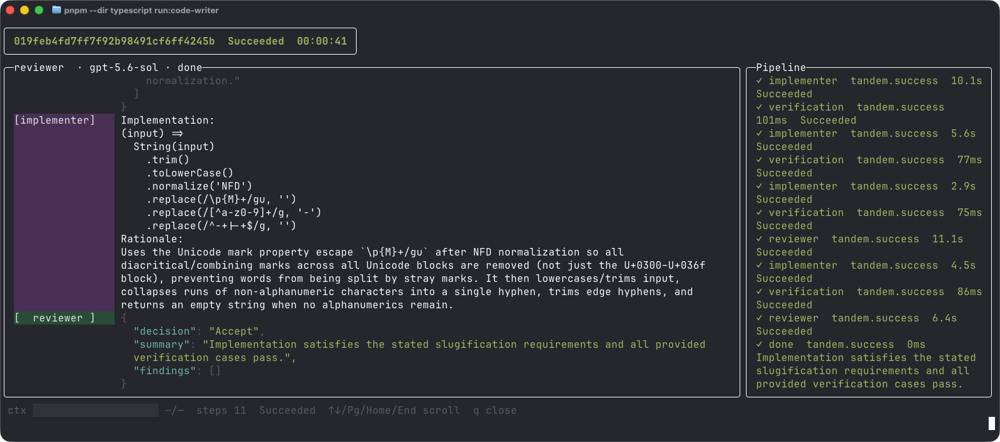

<p align="center">
  <h1 align="center">Tandem</h1>
  <p align="center">
    <a href="https://www.nuget.org/packages/Meridian.Tandem"></a>
    <a href="https://www.npmjs.com/package/@maxanstey-meridian/tandem"></a>
    
  </p>
</p>

**The configured pipeline is the lifecycle.** Tandem is a typed SDK for building agentic
applications as explicit pipelines. You declare the facts your application knows, the
participants that act on them, and the routes between them, all in code. Then you run it and
inspect what happened.

There's no hidden coordinator deciding what an agent does next. Agents return typed output,
capabilities are typed actions, and routes read typed state. Microsoft Agent Framework runs the
model loops, sessions and tool dispatch underneath. Author in C#, or author the same pipeline in
TypeScript.

<p align="center">
  
</p>

Looking for a ready-to-run coding pipeline? [Cadence](https://github.com/maxanstey-meridian/cadence)
uses Tandem to plan, implement, verify and review changes in an isolated workspace.

## Install

C# needs the .NET 10 SDK:

```sh
dotnet add package Meridian.Tandem
dotnet add package Meridian.Tandem.Generators
```

TypeScript needs Node.js 22 or newer and the .NET 10 runtime, on macOS (Apple silicon) or
Linux x64:

```sh
npm install @maxanstey-meridian/tandem zod
```

## The idea in one pipeline

An implementer agent writes code, a reviewer agent accepts it or requests changes, and routes
decide what happens next:

```ts
import { pipeline, route } from "@maxanstey-meridian/tandem";

const codeWriter = pipeline({
  name: "code-writer",
  // Every participant reads and returns this same state shape.
  state: State,
  nodes: [implementer, reviewer, done, failed],
  start: implementer,

  routes: [
    // Submitted code goes straight to review.
    route({ from: implementer, to: reviewer, outcome: "success" }),
    // An accepted review finishes the run.
    route({
      from: reviewer,
      to: done,
      outcome: "success",
      when: (state) => state.review?.decision === "Accept",
    }),
    // Requested changes go back around with the same state.
    route({
      from: reviewer,
      to: implementer,
      outcome: "success",
      when: (state) => state.review?.decision === "RequestChanges",
    }),
    // A fault is different from requesting changes.
    route({ from: implementer, to: failed, outcome: "failed" }),
    route({ from: reviewer, to: failed, outcome: "failed" }),
  ],

  // The only places a run may finish.
  outputs: [done, failed],
  // Keep accepted values so the run can be inspected later.
  persist: true,
});
```

The same machine in C#:

```csharp
var codeWriter = Pipeline
    .Start(implementer, "code-writer")
    .Route(on: implementer.Success, to: reviewer, label: "submitted")
    .Route(
        on: reviewer.Success,
        when: state => state.Review?.Decision == ReviewDisposition.Accept,
        to: done,
        label: "accepted")
    .Route(
        on: reviewer.Success,
        when: state => state.Review?.Decision == ReviewDisposition.RequestChanges,
        to: implementer,
        label: "changes requested")
    .Route(on: implementer.Failed, to: failed, label: "implementer failed")
    .Route(on: reviewer.Failed, to: failed, label: "reviewer failed")
    .Persist()
    .Build(done, failed);
```

`state.review?.decision` is a typed value the reviewer returned through a validated schema, not
prose another model had to interpret. "Requested changes" is a successful outcome, routed back
around. A model fault is a failure, routed elsewhere.

## The rules

```text
Facts in state.
Decisions in routes.
Permissions in capabilities.
Humans in interactions.
Runtime mechanics below the seam.
```

## Also in the box

- [Capabilities](https://maxanstey-meridian.github.io/tandem/guides/capabilities): typed,
  validated actions an agent is explicitly permitted to take
- [Stages](https://maxanstey-meridian.github.io/tandem/guides/stages): deterministic steps in the
  same graph, for verification, database work or API calls
- [Interactions](https://maxanstey-meridian.github.io/tandem/guides/interactions): typed
  handoffs to a person, a UI or another system
- [Parallel groups](https://maxanstey-meridian.github.io/tandem/guides/parallel) and
  [collections](https://maxanstey-meridian.github.io/tandem/guides/collections): concurrent work,
  merged deterministically
- [Persistence](https://maxanstey-meridian.github.io/tandem/guides/persistence): an append-only
  SQLite ledger of everything a run accepted
- [Workspace tools](https://maxanstey-meridian.github.io/tandem/guides/workspace-tools): file,
  Git and command tools for agents that work in a repository
- [Tandem Studio](https://maxanstey-meridian.github.io/tandem/guides/studio): a local viewer for
  TypeScript pipelines

## Documentation

[Getting Started](https://maxanstey-meridian.github.io/tandem/getting-started) ·
[The Mental Model](https://maxanstey-meridian.github.io/tandem/guides/mental-model) ·
[Agents](https://maxanstey-meridian.github.io/tandem/guides/agents) ·
[Examples](https://maxanstey-meridian.github.io/tandem/guides/examples) ·
[Limitations](https://maxanstey-meridian.github.io/tandem/misc/limitations)

The TypeScript SDK's source lives in [tandem-ts](https://github.com/maxanstey-meridian/tandem-ts).
Contributors should read [CONTRIBUTING.md](CONTRIBUTING.md) for the architecture boundaries and
invariants.

## License

[MIT](LICENSE)
